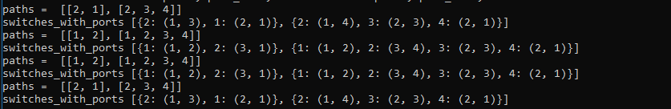

# SDN-Network-Sniffer
A network packet sniffer designed for software defined networks that can sniff packet for the whole network independent of the sniffer location.The sniffer can help us to monitor/detect malicious activities in the network.We can also debug or analyze network traffic for potensial errors.

## Features
- Standard pcap format for packet capture.
- Sniffer can be attached at any location in the network.
- Customizaton available for types,count of packets required to be monitored across the network.

## Topology

<!-- Order of screenshots -
* screenshots/ryu_start.PNG
* screenshots/starting_mininet.PNG
* screenshots/ryu_after_mininet_start.PNG
* screenshots/starting_sniffer.PNG
* screenshots/ping_a1_b1.PNG
* screenshots/ryu_after_ping_a1_b1.PNG
* screenshots/capture_after_ping_a1_b1.PNG
* screenshots/ping_b1_d1.PNG
* screenshots/ryu_after_ping_b1_d1.PNG
* screenshots/capture_after_ping_b1_d1.PNG
* screenshots/s2_flows.PNG -->

## Environment requirements -
* Python 3.8+ on controller machine and machine where mininet will run.
* Ryu Framework on machine which is to act as controller, install by:`pip3 install ryu`.
* On mininet machine, install scapy using command:`pip3 install scapy`.

## Run commands in the order as they appear.
* To run controller: `ryu-manager ryu-sniffer.py --observe-links`.
    * For topology.py, switch number is `4` and sniffer port number is `1`.  
    
* To run mininet topology: `sudo python3 topology.py <controller-ip>`. 
    
    
* To start sniffer in mininet: `sniffer python3 sniff.py &`. To see options to sniff.py run `sniffer python3 sniff.py -h`  
    
* Now exchange packets between hosts in mininet, they will be recorded by the sniffer but will not be displayed on mininet as it currently does not support background processes for hosts. 
    * `a1 ping -c 1 b1`  
    
    
    
    * `b1 ping -c 2 d1`  
    
    
    
    * Flows installed in s2
    
